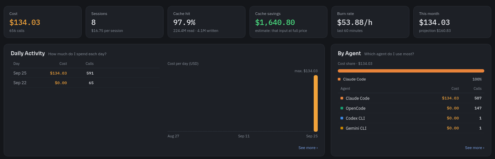
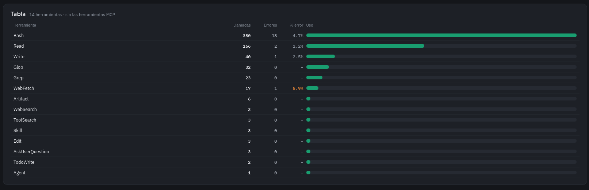

<div align="center">


# AgentBoard

**El panel de coste y actividad de tus agentes de código, en local.**

Reúne en una sola vista qué hacen Claude Code, Codex, Copilot, Cursor, Gemini y OpenCode
—y cuánto cuestan— leyendo los logs que ya tienen en el ordenador. Nada sale de la máquina.


</div>

---

## Qué es

Los agentes de código —Claude Code, Codex, Copilot, Cursor, Gemini, OpenCode— generan mucha
actividad: llamadas al modelo, tokens, sesiones, herramientas y comandos, y con ello un gasto
que normalmente queda **repartido, opaco y encerrado en cada herramienta**. No hay un sitio que
responda de un vistazo *cuánto llevo gastado este mes*, *qué modelo me sale más caro* o *en qué
se me va el tiempo del agente*.

**AgentBoard es una aplicación de escritorio que responde justo eso.** Cada uno de esos agentes
deja registros (logs) en el ordenador; AgentBoard los **lee, los cruza y los presenta** en un
panel con coste, tokens, sesiones, actividad, herramientas, modelos y proyectos. Todo el trabajo
ocurre en la máquina:

- **Local y privado** — sin proxy, sin claves de API, sin telemetría. Ningún dato sale del equipo.
- **Solo lectura** — lee los logs que ya existen; no toca ni interfiere con el trabajo de los agentes.
- **Sin persistencia** — los datos de uso viven en una base **SQLite en memoria** mientras la app
  está abierta; lo único que se guarda en disco es el archivo de ajustes. Al cerrar, no queda rastro.

## Para qué sirve

- **Controlar el gasto** — ver el coste del día y del mes, la proyección a fin de mes y un aviso
  al acercarse al presupuesto.
- **Entender el uso** — saber qué agente y qué modelo se usan más, y con qué eficiencia de caché.
- **Ver en qué se trabaja** — el reparto por actividad (coding, testing, debugging…), por
  proyecto y por rama de git.
- **Detectar fricción** — qué herramientas y comandos fallan más.
- **Consultarlo desde otro agente** — vía un servidor MCP, un agente puede preguntar estos datos
  en medio de una conversación.

---

## El panel

<div align="center">



</div>

| El desglose por herramienta | |
|:---:|:---|
|  | Llamadas y porcentaje de error por herramienta, con su barra de uso. Cada apartado tiene su tabla y su gráfico, y una vista ampliada al pulsarlo. |

---

## Qué muestra

Un panel lateral para organizarlo todo (apartados, periodo, agentes y proyectos), y cada
apartado con su tabla y su gráfico.

| | |
|---|---|
| 📊 | **Resumen** — coste, llamadas, sesiones, cache hit, ahorro por caché, burn rate y gasto del mes con su proyección |
| 📅 | **Daily Activity** — cuánto se gasta cada día |
| 🤖 | **By Agent** — qué agente se usa más y cuánto cuesta cada uno |
| 📁 | **By Project** — coste por proyecto y por rama, con el *overhead* de contexto |
| 🧭 | **By Activity** — coding, testing, debugging, exploración, conversación… |
| 🧠 | **By Model** — coste, cache hit y llamadas por modelo |
| 🔧 | **Tools / Shell Commands** — uso y errores por herramienta y por comando |
| ✨ | **Skills & Agents / MCP Servers / Agent Types** — skills, subagentes y servidores MCP |

Además: **en vivo** (relee los logs al vuelo con un vigilante de archivos), **bandeja del sistema**
con el gasto del mes, **avisos de presupuesto** (80 % y 100 %), **exportar** a CSV/JSON, **temas**
claro/oscuro/sistema e **idiomas** (es, en, pt, fr).

---

## Qué usa

| Capa | Tecnología | Por qué |
| --- | --- | --- |
| Escritorio | **Tauri 2** | Un solo binario nativo para Linux, Windows y macOS, ligero (usa el WebView del sistema) |
| Núcleo | **Rust** | Lee y agrega los logs rápido y con seguridad de memoria |
| Base de datos | **SQLite (rusqlite), en memoria** | Consultas SQL sobre los datos sin escribir nada en disco |
| Interfaz | **React + TypeScript + Vite** | Panel, tablas y gráficos hechos a medida |
| En vivo | **notify** | Vigila las carpetas de logs y relee al vuelo |
| Integración | **Model Context Protocol** | Expone los datos a cualquier agente compatible |
| Especificación | **OpenSpec** | Cada cambio se describe antes de implementarse (`openspec/`) |

---

## Cómo está montado

```
┌──────────────────────────┐        ┌──────────────────────────┐
│  Interfaz (React + TS)   │        │  Agente de IA            │
│  panel, tablas, gráficos │        │  (Claude Code, Codex…)   │
└────────────┬─────────────┘        └────────────┬─────────────┘
             │ comandos Tauri                     │ MCP (stdio)
             ▼                                     ▼
        ┌─────────────────────────────────────────────────┐
        │  Núcleo en Rust                                  │
        │  providers · ingesta · consultas · precios       │
        └────────────────────────┬────────────────────────┘
                                 │ escanea (solo lectura)
                                 ▼
              SQLite en memoria  ◀── logs de los agentes en disco
```

- **Un módulo por agente** (`providers/`): detecta el agente, sabe dónde están sus logs y parsea
  sus registros a unos tipos comunes (sesiones, llamadas, turnos, usos de herramienta).
- **Ingesta incremental** por offsets: releer solo procesa lo nuevo y cada llamada se identifica
  por su `message_id`, así que nunca duplica.
- **Consultas** agregadas (SQL) que alimentan cada apartado, respetando el filtro común.
- **Precios** por modelo para calcular coste y ahorro por caché.
- **Servidor MCP** aparte que reutiliza todo lo anterior.

Detalle completo en la [wiki](docs/wiki/Home.md) y en [`CONTRIBUTING.md`](CONTRIBUTING.md).

---

## De dónde salen los datos

| Agente | Origen |
| --- | --- |
| Claude Code | `~/.claude/projects/**/*.jsonl` (o `$CLAUDE_CONFIG_DIR`) |
| Codex CLI | `~/.codex/sessions/**/rollout-*.jsonl` (o `$CODEX_HOME`) |
| GitHub Copilot CLI | `~/.copilot/session-state/*/events.jsonl` (o `$COPILOT_HOME`) |
| Cursor CLI | `~/.cursor/projects/*/agent-transcripts/*/*.jsonl` |
| Gemini CLI | `~/.gemini/tmp/*/chats/session-*.jsonl` (o `$GEMINI_CLI_HOME`) |
| OpenCode | base SQLite de OpenCode (lectura incremental) |

Un agente aparece en la lista si está instalado, aunque aún no tenga sesiones; sus datos salen
en cuanto existan. El texto de los prompts y las respuestas no se guarda en ningún sitio.

---

## Servidor MCP

`agentboard-mcp` expone los mismos datos a cualquier agente por Model Context Protocol (stdio),
**sin necesitar la app abierta**: escanea los logs a memoria al arrancar y responde por
JSON-RPC. Así un agente puede preguntar «¿cuánto llevo gastado este mes?» o «¿qué modelo me sale
más caro?» durante una conversación.

```bash
cd src-tauri && cargo build --release --bin agentboard-mcp
claude mcp add agentboard -- $(pwd)/target/release/agentboard-mcp
```

15 herramientas (`get_summary`, `get_cost_by_model`, `get_daily`, `list_agents`…), todas con
filtro opcional de `period`, `agents` y `projects`. Es un servidor MCP estándar: sirve para
Claude Code, Codex, Gemini, Cursor, OpenCode… Guía completa en la
[wiki del MCP](docs/wiki/Servidor-MCP.md).

---

## Instalación

Descarga el instalador de tu sistema desde
[**Releases**](https://github.com/RenzoRamosDEV/AgentBoard/releases):

- **Linux** — `.AppImage` o `.deb`
- **Windows** — `.msi` o `.exe`
- **macOS** — `.dmg` (universal, Intel + Apple Silicon)

> [!NOTE]
> Los binarios de Windows y macOS van sin firmar; la primera vez el sistema pedirá confirmación
> (SmartScreen / Gatekeeper).

---

## Desarrollo

Requisitos: Node.js 20+, Rust estable y, en Linux, WebKitGTK 4.1.

```bash
npm ci
npm run tauri dev     # app con recarga en caliente
npm test              # tests del frontend (vitest)
```

Backend y servidor MCP:

```bash
cargo test  --manifest-path src-tauri/Cargo.toml
cargo build --manifest-path src-tauri/Cargo.toml --bin agentboard-mcp
```

Cada Pull Request compila y prueba en **Linux, Windows y macOS**. Ver [`CONTRIBUTING.md`](CONTRIBUTING.md).

---

## Licencia

[MIT](LICENSE) © Renzo Ramos
